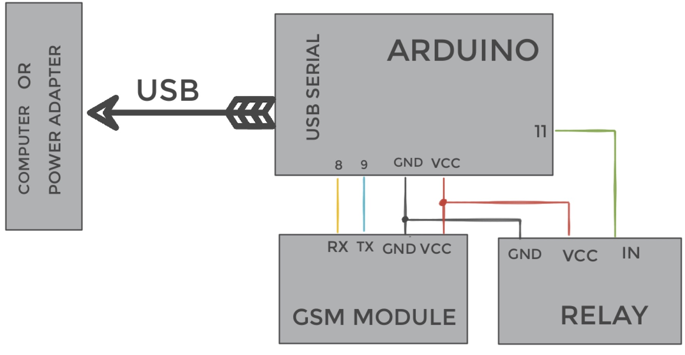

# GSM_Relay
Arduino based remote relay which can be activated for a predefined time by unanswered (thus free) GSM voice call. 
Gate, light, boiler or any other device can be handled.

## Hardware parts:

- Arduino compatible board (e. g.  Arduino Nano, any m328 based 5 V Arduino or breadboarded ATmega328p or any similar device), 
- GSM module (AT commands compatible),
- at least 1000 μF capacitor connected to (GND, VCC) to prevent resetting the system on GSM transmission peaks (without the capacitor is GSM module unstable).

Take care about voltage (all devices has to use the same (probably 5V), otherwise level convertor must be used). 

The parts used and tested are
- [Arduino Nano](http://store.arduino.cc/products/arduino-nano)
- [Air208](https://fccid.io/2AEGG-AIR208/User-Manual/User-Manual-3829903) GSM module
- Relay like [this](https://arduinogetstarted.com/tutorials/arduino-relay)


## Wiring 
Arduino compatible device uses two serial interfaces: 
1. harware serial (standard RX, TX, available via USB on Arduino Nano) is used for configuration, sketch uploading and debugging , 115200 Bd unless changed (core `Serial`)
2. software serial on pins 8 (RX), 9 (TX) are attached to the GSM module (library `AltSoftSerial` on Arduino Nano is used at 9600 Bd)

Relay is connected to Arduino pin specified in sketch `#define PIN_RELAY 11` (and to 5V and GND).





## Configuration
At least two settings using terminal (via hw serial interface used for sketch uploading) must be done:

### register authorised number(s) -  `REG` command

- register user(s)  authorised phone number(s) to SIM phonebook item of given *index* with given *contactName* (only phone numbers stored in SIM phonebook whose *contactName*  first four characters are  "REG " ('R', 'E', 'G', space) are considered to be authorized, this prefix is appended by `REG` command)
```
REG <index> +420xxxxxxxxx <contactName>
REG 1 +42012345678 Joe
REG 2 +42000000000 Jane
```

- list phonebook directory on SIM:
`REG` 

- register admins authorised phone number and store it to Arduino's eeprom 
`REG  +420xxxxxxxxx`

- extra authorised number can be hardcoded using `myNum` global variable in the sketch
        

### how many seconds are added on single voice call - `PERIOD` command

`PERIOD <numberOfSeconds>`


 ## Usage


- Calls from unauthorised numbers are immediately hang by GSM_Relay on remote side.


- To switch the remote relay ON for a time specified by `PERIOD`, make a voice call from authorised phone number to the GSM_Relay device and *do not hang*. 
After 4 rings, *the remote side will hang* (so you know your call was accepted) and relay switched on for a period (invoke `STATUS` command  to see remaining time).

- When you repeat your call while relay is ON, the remaining time is incremented (until number of call reach maxVoiceCalls limit).

- To switch the relay OFF immediately, voice call GSM_Relay, wait for the first ring and hang up.


